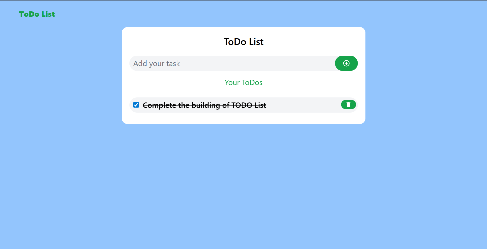

# ToDoList App

A simple and elegant To-Do List application built using **React**, styled with **Tailwind CSS**, and enhanced with **React Icons**. This project helps users manage their daily tasks with an intuitive and responsive interface.

## 🚀 Features

- ✅ Add new tasks
- ❌ Delete tasks
- 🗂️ Organize and view your to-dos in a clean layout
- 📱 Fully responsive design
- 💅 Styled with Tailwind CSS
- 🎨 Icon support via React Icons

## 🖼️ Preview

> Screenshots are located in the `src/assets/ScreenShots` folder

## 🛠️ Tech Stack

- [React](https://reactjs.org/)
- [Tailwind CSS](https://tailwindcss.com/)
- [React Icons](https://react-icons.github.io/react-icons/)
- [Vite](https://vitejs.dev/) for fast development

## 📁 Folder Structure

.
├── public
├── src
│ ├── assets
│ │ ├── ScreenShots
│ │ │ └── Screenshot.png
│ │ └── react.svg
│ ├── components
│ │ └── NavBar.jsx
│ ├── App.jsx
│ ├── index.css
│ ├── main.jsx
├── .gitignore
├── index.html
├── package.json
├── postcss.config.js
├── tailwind.config.js
├── vite.config.js
└── README.md
